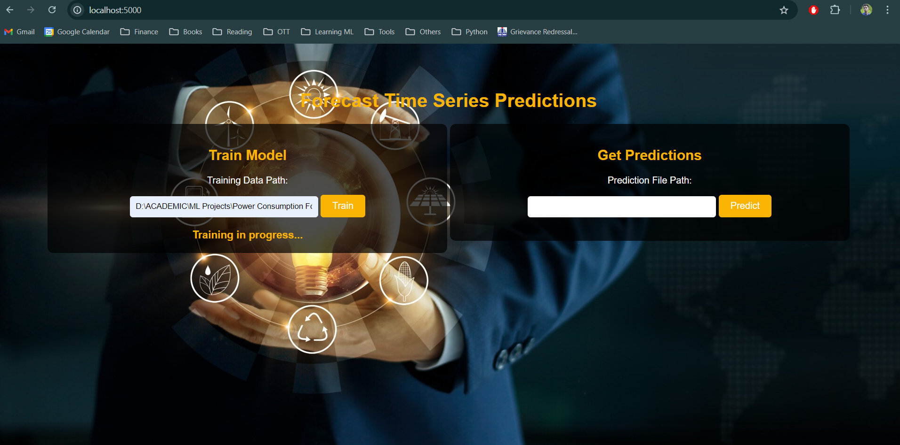
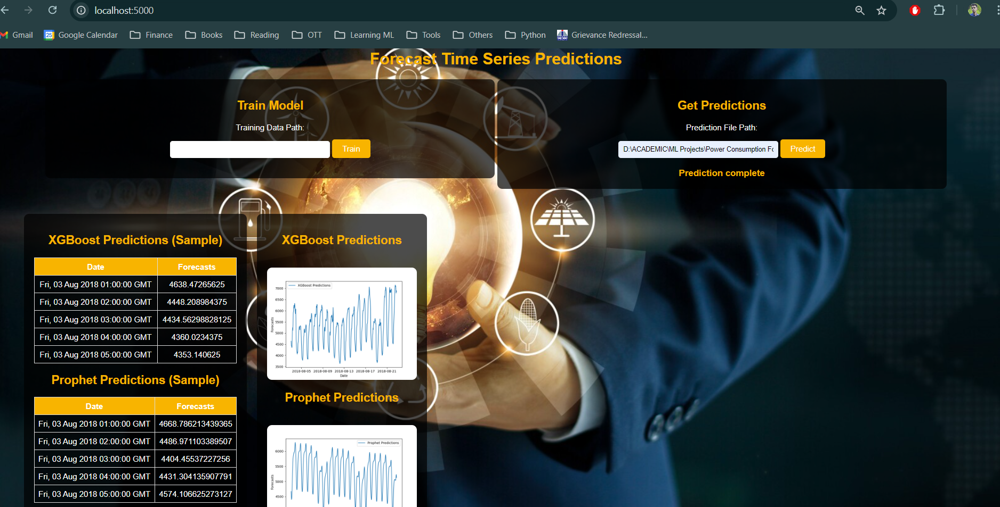

# Power Consumption Forecasting (Time Series)




## Project Overview
PJM Interconnection LLC (PJM) is a regional transmission organization (RTO) in the United States. It is part of the Eastern Interconnection grid operating an electric transmission system serving all or parts of Delaware, Illinois, Indiana, Kentucky, Maryland, Michigan, New Jersey, North Carolina, Ohio, Pennsylvania, Tennessee, Virginia, West Virginia, and the District of Columbia. The hourly power consumption data comes from PJM's website and are in megawatts (MW). The regions have changed over the years so data may only appear for certain dates per region.

# Data Dictionary
1. Datetime: Timestamp column for every hour
2. PJMW_MW: estimated energy consumption in Megawatts (MW)


This project aims to forecast future power consumption using a hourly time series dataset. The data is modelled on XGBoost and Prophet for predictions. This project can be deployed to cloud or applications like Heroku


## Model and Libraries

- **Pandas**: Data manipulation and analysis
- **NumPy**: Numerical computations
- **XGBoost**: Model prediction
- **Prophet**: Time Series Model prediction


## Usage
### Data Requirement (IMPORTANT !)
Please ensure the following rules in data while accessing the project
1. Train: For training, the data should have only two columns- first column should be timestamp(datetime) and the second column should have values(int/float)
2. Prediction: For prediction, the data should have only one column which is timestamp.

Note: Training can take a max of 40-60 mins depending on the size of the data as it trains on both XGBoost and Prophet model. if you are predicting first, then ensure the data has hourly timestamp interval as the model is pretrained on the same. 

### API Endpoints
#### Home
- URL: /
- Method: GET
- Description: Renders the home page showing train and prediction path

#### Predict
- URL: /predict
- Method: GET
- Description: Forecasts the future power consumption for the provided timeperiod data

#### Train
- URL: /train
- Method: POST
- Description: Trains the model on XGBoost and Prophet on the provided time series data

## How to Run Locally

To run the Power Consumption Forecast project locally, follow these steps:

1. **Clone the repository**:

    ```sh
    git clone https://github.com/BenRoshan100/Power-Consumption-Forecasting.git
    ```

2. **Navigate to the project directory**:

    ```sh
    cd power-consumption-forecasting
    ```

3. **Install the required packages**:

    ```sh
    pip install -r requirements.txt
    ```

4. **Run the application**:

    ```sh
    python main.py
    ```

5. **Open your web browser and go to**:

    ```sh
    http://127.0.0.1:5000/
    ```

You should now be able to access the application locally and use its features for forecasting power consumption.

## License

This project is licensed under the personal License.

## Acknowledgments

- The dataset and inspiration for the project: [Hourly Energy Consumption Dataset on Kaggle](https://www.kaggle.com/datasets/robikscube/hourly-energy-consumption)

- Python and its libraries:
  
- Pandas:
  
- NumPy:
  
- XGBoost:
  
- Prophet:
  
- Flask for the web framework.
- iNeuron Institute for the data pipeline flow

